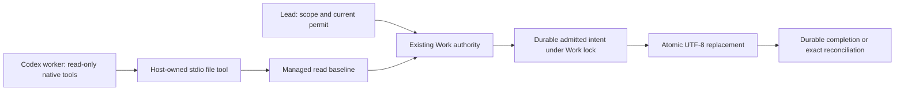

# Controlled file effects

For a current governed worker, `exitbind work act WORK --controlled-effects`
selects an explicit, fresh Codex session with a read-only project surface and
one assignment-bound stdio MCP file tool. The Lead still decides scope and
whether to issue the ordinary mutation permit. The tool enforces that authority
at the existing file-effect owner.
Before launch, the host obtains `allowed:true` through the current worker's
`work permit` route. Controlled launch verifies that existing unconsumed permit
and carries its grant-event identity to the worker. It issues no permit itself.
The file tool checks current authority again at admission.

| Host and path | UTF-8 replacement capability |
| --- | --- |
| Linux, Codex 0.160.0, host-writable source, explicit controlled launch, capability preflight passes | **enforced** for this file effect |
| Ordinary native workspace-write, including the managed shell tool and expert `work write` | **mediated/advisory**; equivalent native writes remain possible |
| Controlled launch on other OS/version, inherited project/system/managed Codex configuration, failed protection preflight, or resumed session | **unsupported**; the explicit option refuses |

The supported cell trusts the operator's installed Codex and Exitbind binaries
and their launch environment. It constrains the governed worker and its child
commands. It does not claim protection against a separate privileged or
same-account operator, or control over network, GitHub, package-manager or
arbitrary external effects.

The launcher ignores user configuration and execpolicy rules, disables apps,
plugins and hooks, refuses project/system/managed Codex configuration, and configures
only this MCP server. Its per-tool approval setting permits transport calls;
it grants no file authority. A native read-only preflight must observe the
selected source, control, state and executable roots as present and unwritable.
The launch marks inherited non-stdio descriptors close-on-exec; Linux kernels
without the required descriptor protection refuse the launch.
Neither declarations nor tool annotations establish enforcement.

Use the MCP `file` tool with `action` and project-relative `path`:

- `read` captures UTF-8 content or actual absence.
- `edit` supplies full replacement `content`, up to 256 KiB.
- `inspect` reports the saved baseline, request and effect status.
- `refresh` deliberately captures a new baseline after a resolved request.

Requests cannot choose an owner, Work, assignment, configuration, operation ID
or expected digest. The launcher fixes the session; immutable preparation binds
it to the governing executable, configuration and current worker. Paths outside
the declared read/write boundaries, control/evidence paths, symlinks and
hard-link aliases are refused.

## Admission and recovery

The admission linearization point is the durable admitted journal, under the
canonical Work lock and before replacement. The owner checks current assignment,
policy, permit, expected bytes and protected targets while holding that lock.
A transition committed first fences a late new effect. A concurrent transition
cannot commit through the held effect lock.

An already-admitted exact intent may finish or reconcile after assignment
transition; it receives no new permit. Reusing its identity with changed bytes
is a conflict. Changing the governing binary/configuration prevents automatic
reconciliation. Ambiguous target bytes remain uncertain and cannot be overwritten
by replay. Historical admitted journals lacking a governing-instance binding
require explicit inspection; historical completed no-change replay remains readable.

| Process stops at | Recovery |
| --- | --- |
| Before durable admission | Retry requires current authority |
| After admission, before replacement | Exact expected target permits finishing the same intent |
| After replacement, before completion | Matching result digest records completion without another replacement |
| After completion, before response | Matching durable result returns a no-change replay |

Intent, target and completion writes synchronize the file and parent directory.
The crash fixtures kill the actual effect process at these four boundaries and
check inode preservation, parameter conflicts, transition ordering and grant
count. They do not claim exactly-once arbitrary effects or every storage failure.

The native session is ephemeral and cannot resume provider execution. A retained
completed native result can be returned without another provider call. For file
reconciliation, use the recorded `controlledSession` with the ordinary
`work file inspect|edit SESSION PATH` route and the exact governing binary and
configuration; supply identical edit content. Missing/corrupt state is never reset
or reconstructed. A file receipt does not complete checks, review or acceptance.
